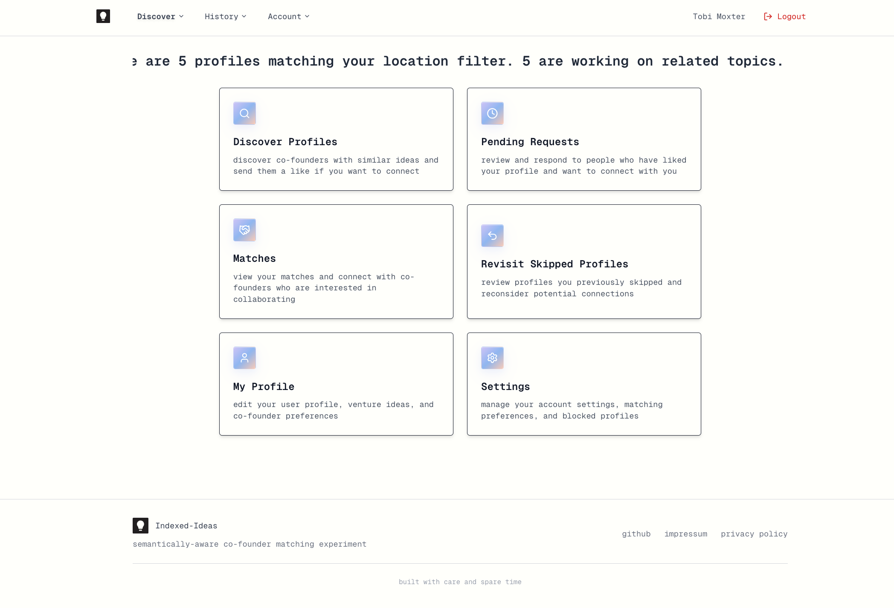
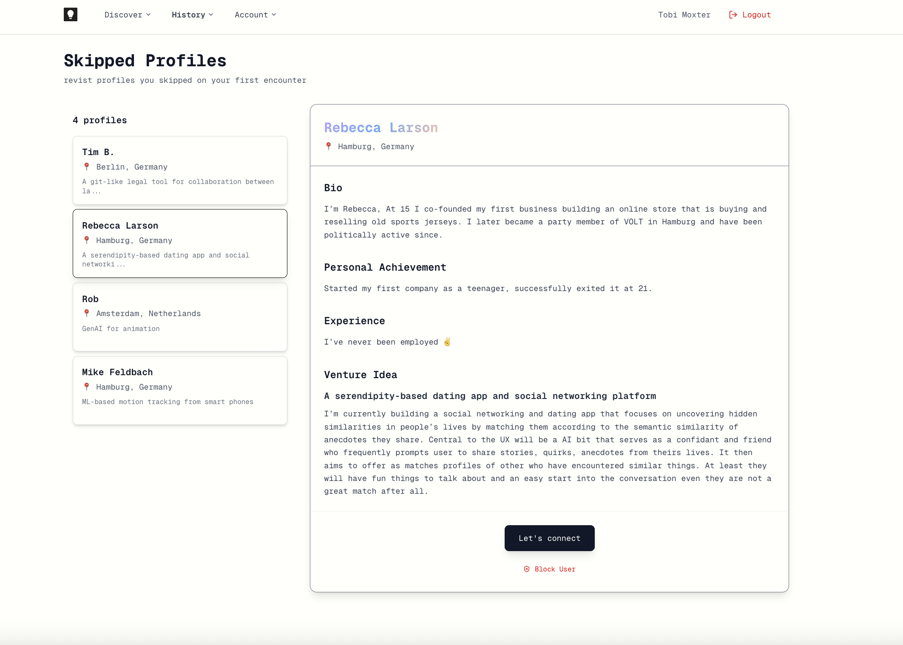

# Indexed-Ideas
A lightweight, minimal, and free co-founder matching platform that leverages the semantic similarity of users' venture ideas, reseach-, or side projects to connect people tackling the same problems. Built on Vercel, Supabase and Jina.

I started this project because I found it hard to connect with co-founders who are working on related topics on well-known co-founder matching platforms such as from YC. While these platforms all let you describe what you are working on, search filters are limited to broad categories. Areas of interest such as 'Biotech' or 'Finance' still include a diverse landscape of unrelated ideas leaving you with many potential co-founders but few that understand what you do.
The goal is here is to offer a better signal-to-noise ratio and shift the focus from users' backgrounds to their work. Convincing potential co-founders of your vision makes for great sales practice but in-efficient search.

Gallery:

  
  
  

